# 📊 Customer Analytics & Segmentation

End-to-end Data Analytics project that transforms raw customer transactions into actionable business insights using **SQL**, **Python**, and **Power BI**.

---

## 📌 Project Overview

This project analyzes 800 customers and 3,700+ transactions (2022–2025) to answer key business questions related to customer demographics, purchase behavior, lifetime value, churn risk, and customer segmentation.

The complete pipeline follows a real-world data analyst workflow:

**SQL → Python (Pandas + Scikit-learn) → Power BI Dashboard**

---

## 🛠️ Tools & Technologies

- **SQL (MySQL)** – Data extraction and business analysis
- **Python** – Data cleaning, exploratory data analysis (EDA), and visualization
- **Pandas & NumPy** – Data manipulation
- **Scikit-learn** – K-Means clustering for customer segmentation
- **Matplotlib & Seaborn** – Charts and visual insights
- **Power BI** – Interactive Customer Analytics Dashboard
- **Git & GitHub** – Version control and project showcase

---

## ✨ Key Features

- Overall Customer KPIs (Total Customers, Revenue, AOV, Frequency)
- Customer Demographics Analysis (Gender, Age Group, Region)
- Purchase Frequency & Repeat Customer Analysis
- Customer Lifetime Value (CLV proxy)
- Recency & Churn Indicators
- RFM Analysis (Recency, Frequency, Monetary)
- K-Means Clustering for Customer Segmentation
- Interactive Power BI Dashboard with multiple pages

---

## 📈 Key Insights

- High-Value Champions represent a small percentage of customers but contribute a large share of total revenue
- A significant portion of customers fall into the At-Risk segment based on long recency
- Repeat customers form the majority of the customer base
- Clear behavioral differences exist across the four K-Means segments
- RFM metrics effectively separate high-value customers from low-engagement ones
- Targeted win-back and retention strategies can be applied based on segment profiles

---

## 📁 Project Structure

```
Customer-Analytics-Segmentation/
├── data/
│   ├── customers.csv
│   ├── transactions.csv
│   └── summaries/
├── sql/
│   ├── 01_schema_and_load.sql
│   └── 02_analysis_queries.sql
├── python/
│   ├── 01_customer_segmentation.py
│   └── charts/
├── powerbi/
│   └── Customer_Analytics_Segmentation_Dashboard.pbix
├── docs/
│   └── PowerBI_Dashboard_Guide.md
├── images/
│   ├── sql/
│   ├── python/
│   └── powerbi/
├── requirements.txt
└── README.md
```

---

## 🚀 How to Run the Project

### 1. SQL Analysis (MySQL)
- Create the database and tables using `sql/01_schema_and_load.sql`
- Import `data/customers.csv` and `data/transactions.csv`
- Run the analysis queries from `sql/02_analysis_queries.sql`

### 2. Python Analysis
```bash
pip install -r requirements.txt
python python/01_customer_segmentation.py
```

### 3. Power BI Dashboard
- Open `powerbi/Customer_Analytics_Segmentation_Dashboard.pbix` in Power BI Desktop
- Or follow the step-by-step guide in `docs/PowerBI_Dashboard_Guide.md`

---

## 📊 Dashboard Pages (Power BI)

1. **Executive Overview** – KPIs, Customers by Segment, Revenue by Segment  
2. **Segment Deep Dive** – RFM profiles and behavioral comparison of segments  
3. **Demographics & Behavior** – Gender, Age Group, Region and Recency status  
4. **Recommendations** – Actionable strategies for each customer segment  

---

## 🖼️ Screenshots

### Power BI Dashboard
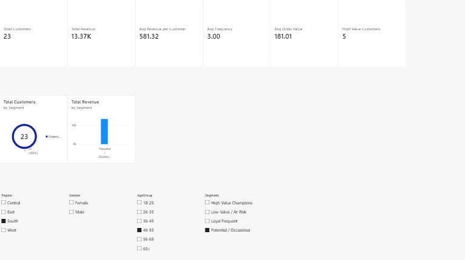
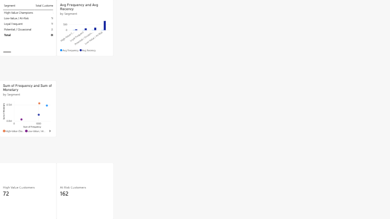
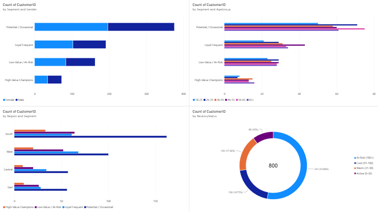
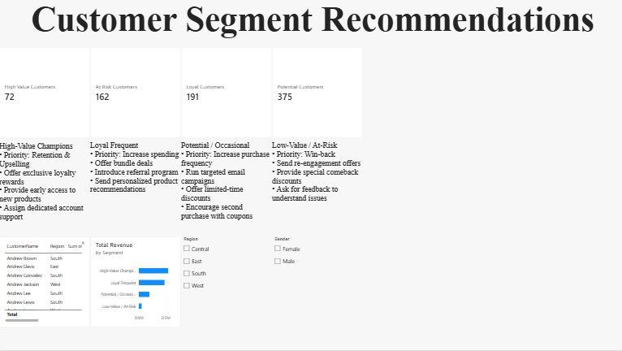

### SQL Analysis
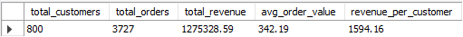
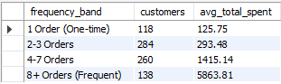
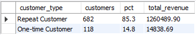
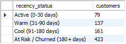
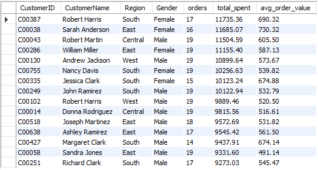

### Python Visualizations
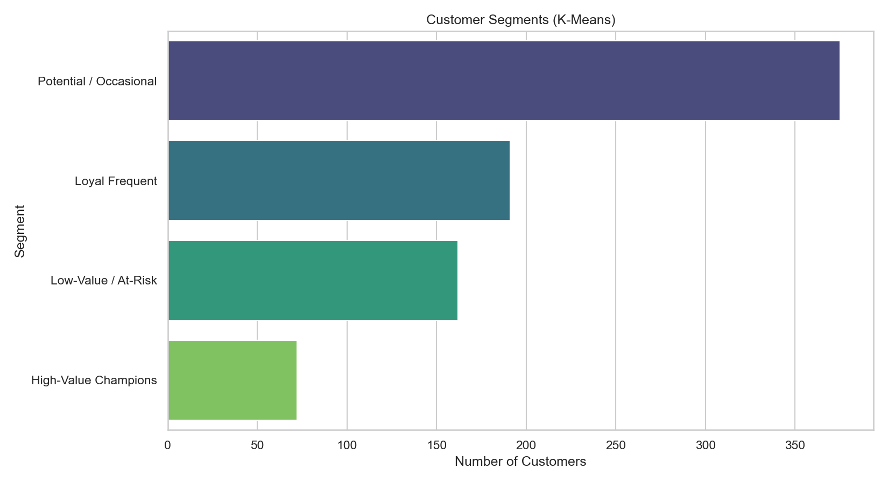
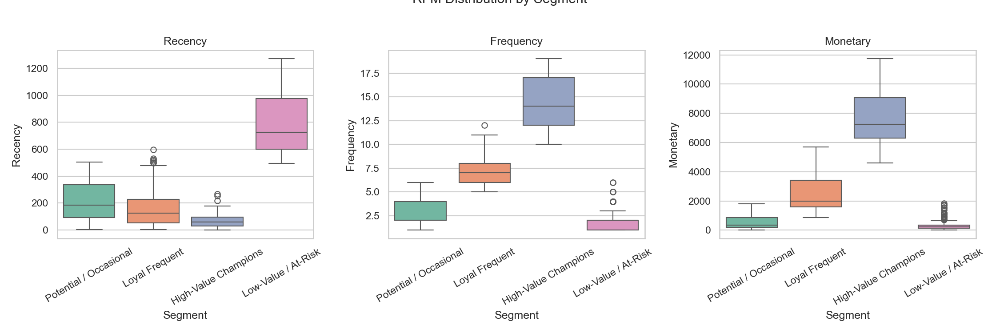
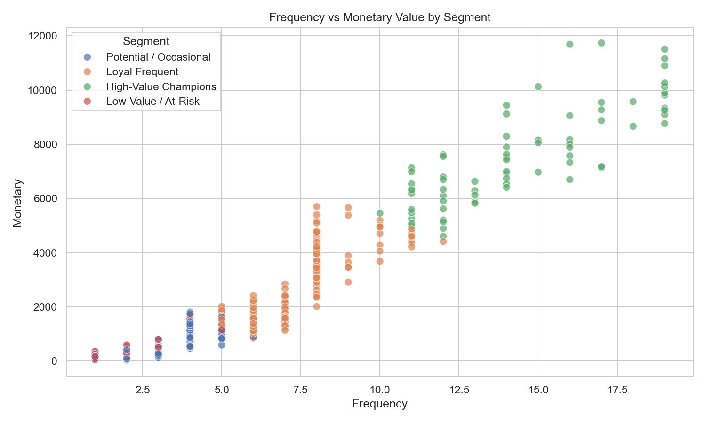
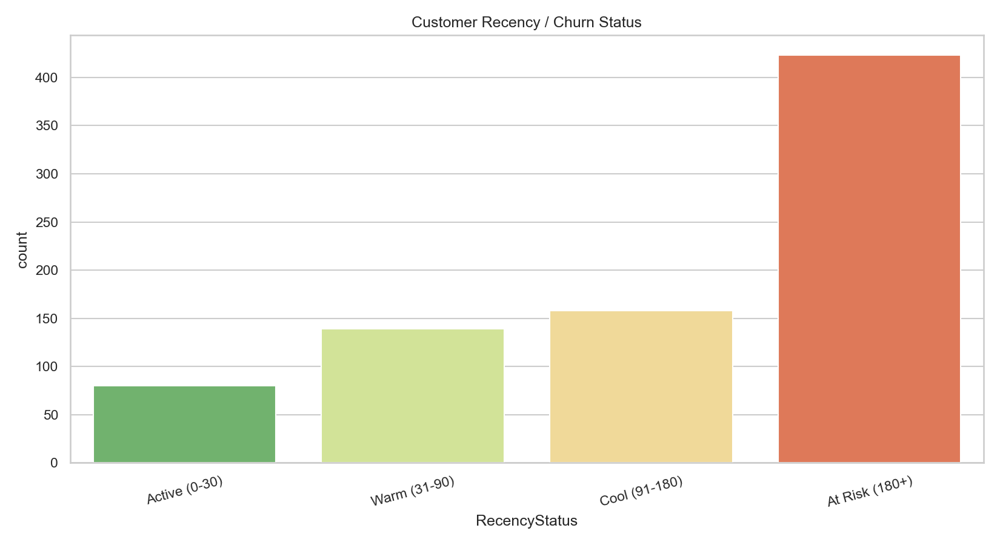
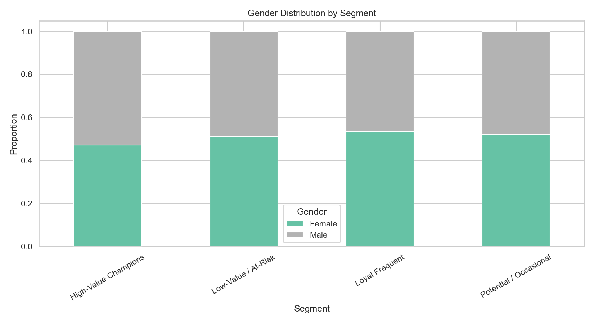
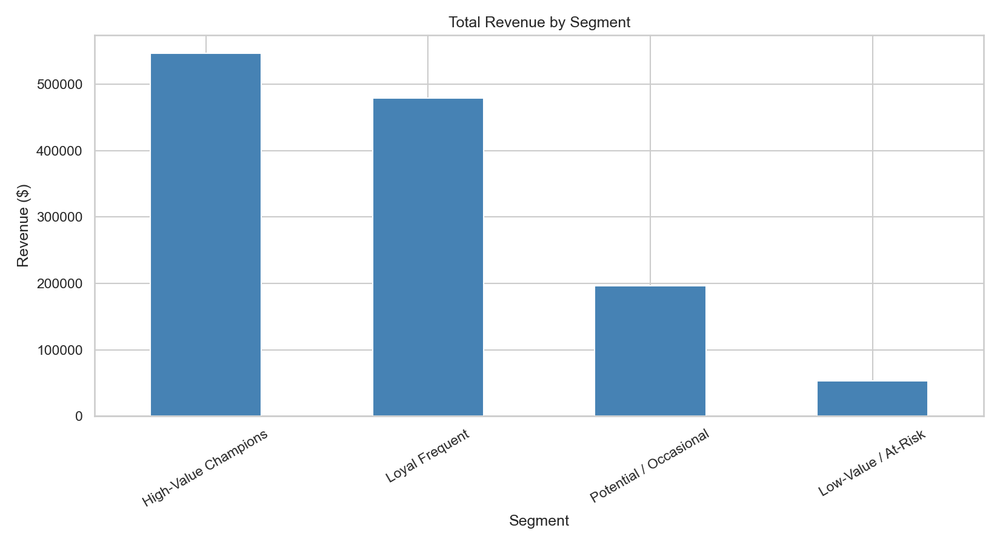

---

## 👤 Author

**Mubeen Salman**  
Aspiring Data Analyst  

- LinkedIn: [https://www.linkedin.com/in/mubeen-salman-459776364/]  
- GitHub: [https://github.com/MuhammadMubeen04]  

---

## 📄 License

This project is for educational and portfolio purposes.
